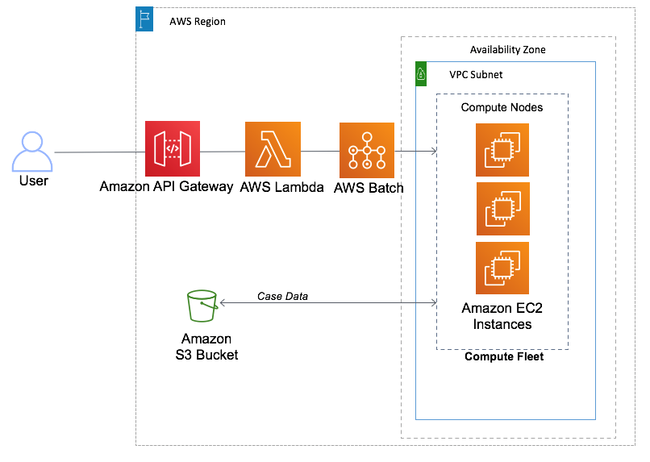

# AWS Project of the subject Cloud Computing of the course of Computer Engineering of INSPER.
## Student: [Guilherme Fontana Louro](https://github.com/guifl2001)

## Project: AWS Lambda

Using AWS Lambda, batch, EC2, AWS ParallelCluster and API Gateway to create a machine learning contanier of production inside S3 bucket



## About AWS Lambda

AWS Lambda is a serverless computing service provided by Amazon as part of the Amazon Web Services. It is a computing service that runs code in response to events and automatically manages the computing resources required by that code. It was introduced in November 2014. The purpose of Lambda, as compared to AWS EC2, is to simplify building smaller, on-demand applications that are responsive to events and new information. AWS targets starting a Lambda instance within milliseconds of an event. Node.js, Python, Java, Go, Ruby, and C# through .NET Core are all officially supported as of 2018, and other languages can be supported via call-outs. However, some runtimes, such as the .NET Core, are only supported in a "preview" mode as of 2018.

## Objectives

- C+: Working environment with AWS Lambda, batch, EC2 and documentation

- B+: Working environment with AWS Lambda, batch, EC2, API Gateway, S3 and documentation

- A+: Working environment with a machine learning container of production inside S3 bucket

Done with AWS Lambda, batch, EC2, API Gateway, S3 and documentation - B+

## Changes made to the project to achieve the objectives using terraform

In this project, I used terraform to create the infrastructure, so I made some changes to the project to make it work with terraform. That way, I didn't use the AWS ParallelCluster, which wasn't in the rubric but was crucial to the proposed project.

That way, this project is more focused on the use of AWS Lambda, batch, EC2, API Gateway, S3 and documentation. Also with the use of terraform and AWS CLI. In this tutorial, You will be able to create a lambda function that will be triggered by an API Gateway, which will send a job to the AWS Batch, which will run the job in an EC2 instance, which will save the result in an S3 bucket. All this using terraform and AWS CLI. In the end, you will be able to test the project using a python hello world script.

## Install Terraform

### Linux

```bash
sudo apt-get update && sudo apt-get install -y gnupg software-properties-common
wget -O- https://apt.releases.hashicorp.com/gpg | \
gpg --dearmor | \
sudo tee /usr/share/keyrings/hashicorp-archive-keyring.gpg
echo "deb [signed-by=/usr/share/keyrings/hashicorp-archive-keyring.gpg] \
https://apt.releases.hashicorp.com $(lsb_release -cs) main" | \
sudo tee /etc/apt/sources.list.d/hashicorp.list
sudo apt update
sudo apt-get install terraform
```

### Windows or Mac

[Follow the tutorial](https://developer.hashicorp.com/terraform/tutorials/aws-get-started/install-cli)

## Check Terraform version

```bash
terraform --version
```

## Configure AWS credentials

[Follow the tutorial](https://docs.aws.amazon.com/cli/latest/userguide/cli-configure-quickstart.html)

create your access key and secret access key in the IAM service of AWS and save it in a safe place for later use.

## Install AWS CLI

[Follow the tutorial](https://docs.aws.amazon.com/cli/latest/userguide/getting-started-install.html)

## Check AWS CLI version

```bash
aws --version
```

if the answer is something like this:

```bash
aws-cli/2.11.21 Python/3.11.3 Linux/5.19.0-35-generic exe/x86_64.ubuntu.22 prompt/off
```

we are good to go!

## Configure AWS CLI

```bash
aws configure
```

now you will be asked to enter your access key and secret access key, enter them and then enter the region you want to use, in this case I will use us-east-1, and finally enter the output format, I will use json.

## Let's now test out Terraform and AWS CLI project

```bash
git clone https://github.com/guifl2001/AWS-lambda
```

Now with the project cloned, let's go to the project folder and run the following commands:

```bash
terraform init
```

```bash
terraform validate
```

With the validate command we can check if there are any errors in the code, if there are no errors we can proceed to the next step.


## References

- [AWS Lambda](https://aws.amazon.com/lambda/)
- [Using Aws ParallelCluster Serveless API for Aws Batch](https://aws.amazon.com/pt/blogs/compute/using-aws-parallelcluster-serverless-api-for-aws-batch/)
- [Amazon API Gateway for HPC job submission](https://aws.amazon.com/pt/blogs/opensource/aws-api-gateway-hpc-job-submission/)
- [Deploy Serveless Aplications with AWS Lambda and API gateway](https://developer.hashicorp.com/terraform/tutorials/aws/lambda-api-gateway)
