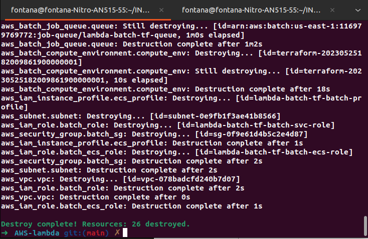

# AWS Project of the subject Cloud Computing of the course of Computer Engineering of INSPER.

## College: [INSPER](https://www.insper.edu.br/en/)

## Student: [Guilherme Fontana Louro](https://github.com/guifl2001)

## Subject: [Cloud Computing]()

## Teachers: [Rodolfo Avelino](https://github.com/rodolfoavelino) and [Tiago Demay](https://github.com/tiagodemay)

# Project: AWS Lambda

Using AWS Lambda, batch, EC2, AWS ParallelCluster and API Gateway to create a machine learning contanier of production inside S3 bucket


## About AWS Lambda

AWS Lambda is a serverless computing service provided by Amazon as part of the Amazon Web Services. It is a computing service that runs code in response to events and automatically manages the computing resources required by that code. It was introduced in November 2014. The purpose of Lambda, as compared to AWS EC2, is to simplify building smaller, on-demand applications that are responsive to events and new information. AWS targets starting a Lambda instance within milliseconds of an event. Node.js, Python, Java, Go, Ruby, and C# through .NET Core are all officially supported as of 2018, and other languages can be supported via call-outs. However, some runtimes, such as the .NET Core, are only supported in a "preview" mode as of 2018.

## Objectives

- C+: Working environment with AWS Lambda, batch, EC2 and documentation

- B+: Working environment with AWS Lambda, batch, EC2, API Gateway, S3 and documentation

- A+: Working environment with a machine learning container of production inside S3 bucket

Done with AWS Lambda, AWS batch, EC2, API Gateway, S3 and documentation - B+

## Changes made to the project to achieve the objectives using terraform

In this project, I used terraform to create the infrastructure, so I made some changes to the project to make it work with terraform. That way, I didn't use the AWS ParallelCluster, which wasn't in the rubric but was crucial to the proposed project.

That way, this project is more focused on the use of AWS Lambda, batch, EC2, API Gateway, S3 and documentation. Also with the use of terraform and AWS CLI. In this tutorial, You will be able to create a lambda function that will be triggered by an API Gateway, which will send a job to the AWS Batch, which will run the job in an EC2 instance, which will save the result in an S3 bucket. All this using terraform and AWS CLI. In the end, you will be able to test the project using a python hello world script.

# Setup

## Install Terraform

### Linux

```bash
sudo apt-get update && sudo apt-get install -y gnupg software-properties-common
wget -O- https://apt.releases.hashicorp.com/gpg | \
gpg --dearmor | \
sudo tee /usr/share/keyrings/hashicorp-archive-keyring.gpg
echo "deb [signed-by=/usr/share/keyrings/hashicorp-archive-keyring.gpg] \
https://apt.releases.hashicorp.com $(lsb_release -cs) main" | \
sudo tee /etc/apt/sources.list.d/hashicorp.list
sudo apt update
sudo apt-get install terraform
```

### Windows or Mac

[Follow the tutorial](https://developer.hashicorp.com/terraform/tutorials/aws-get-started/install-cli)

## Check Terraform version

```bash
terraform --version
```

if the answer is something like this:

```bash
Terraform v1.0.8
on linux_amd64
+ provider registry.terraform.io/hashicorp/aws v3.63.0
```

we are good to go!

## Configure AWS credentials

[Follow the tutorial](https://docs.aws.amazon.com/cli/latest/userguide/cli-configure-quickstart.html)

create your access key and secret access key in the IAM service of AWS and save it in a safe place for later use.

## Install AWS CLI

### Linux

```bash
curl "https://awscli.amazonaws.com/awscli-exe-linux-x86_64.zip" -o "awscliv2.zip"
unzip awscliv2.zip
sudo ./aws/install
```

### Windows or Mac

[Follow the tutorial](https://docs.aws.amazon.com/cli/latest/userguide/getting-started-install.html)

## Check AWS CLI version

```bash
aws --version
```

if the answer is something like this:

```bash
aws-cli/2.11.21 Python/3.11.3 Linux/5.19.0-35-generic exe/x86_64.ubuntu.22 prompt/off
```

we are good to go!

## Configure AWS CLI

```bash
aws configure
```

When prompted, enter your access key and secret access key that you saved earlier. Also, enter the region you want to use. For this project, I used us-east-1. In the end, you can leave the default output format as json.

The output should be something like this:

```bash
AWS Access Key ID [None]: YOUR_ACCESS_KEY
AWS Secret Access Key [None]: YOUR_SECRET_ACCESS_KEY
Default region name [None]: us-east-1
Default output format [None]: json
```

# How the project works and how to use it

## AWS Lambda and S3

To configure the AWS Lambda function, we used the following code:

```terraform
# Create a random bucket name
resource "random_pet" "lambda_bucket_name" {
  prefix = "learn-terraform-functions"
  length = 4
}

# Create a S3 bucket
resource "aws_s3_bucket" "lambda_bucket" {
  bucket = random_pet.lambda_bucket_name.id
}

# Create a zip file with the hello world script
data "archive_file" "lambda_hello_world" {
  type = "zip"

  source_dir  = "${path.module}/hello-world"
  output_path = "${path.module}/hello-world.zip"
}

# Create a S3 object with the zip file
resource "aws_s3_object" "lambda_hello_world" {
  bucket = aws_s3_bucket.lambda_bucket.id

  key    = "hello-world.zip"
  source = data.archive_file.lambda_hello_world.output_path

  etag = filemd5(data.archive_file.lambda_hello_world.output_path)
}

# Create a lambda function
resource "aws_lambda_function" "hello_world" {
  function_name = "HelloWorld"

  s3_bucket = aws_s3_bucket.lambda_bucket.id
  s3_key    = aws_s3_object.lambda_hello_world.key

  runtime = "python3.8"
  handler = "hello.handler"

  source_code_hash = data.archive_file.lambda_hello_world.output_base64sha256

  role = aws_iam_role.lambda_exec.arn
}

# Create a cloudwatch log group
resource "aws_cloudwatch_log_group" "hello_world" {
  name = "/aws/lambda/${aws_lambda_function.hello_world.function_name}"

  retention_in_days = 30
}

# Create a role and policy for the lambda function
resource "aws_iam_role" "lambda_exec" {
  name = "serverless_lambda"

  assume_role_policy = jsonencode({
    Version = "2012-10-17"
    Statement = [{
      Action = "sts:AssumeRole"
      Effect = "Allow"
      Sid    = ""
      Principal = {
        Service = "lambda.amazonaws.com"
      }
      }
    ]
  })
}

# Attach the policy to the role
resource "aws_iam_role_policy_attachment" "lambda_policy" {
  role       = aws_iam_role.lambda_exec.name
  policy_arn = "arn:aws:iam::aws:policy/service-role/AWSLambdaBasicExecutionRole"
}
```

In this code we created a random name for the s3 bucket, we created the s3 bucket, we created a zip file with the code of the lambda function, we uploaded the zip file to the s3 bucket, we created the lambda function, we created the log group and we created the role and policy for the lambda function.

## AWS Batch and EC2

To configure the AWS Batch, we used the following code:

```terraform
#Create a security group for the batch job
resource "aws_security_group" "batch_sg" {
  name        = "${local.project_name}-sg"
  description = "Security group for Batch environment"
  vpc_id      = aws_vpc.vpc.id
  egress {
    from_port   = 0
    to_port     = 0
    protocol    = "-1"
    cidr_blocks = ["0.0.0.0/0"]

  }
}

# Create the Role and Policies for the Batch environment
resource "aws_iam_role" "batch_role" {
  name = "${local.project_name}-batch-svc-role"
  assume_role_policy = jsonencode({
    Version = "2012-10-17"
    Statement = [
      {
        Action = "sts:AssumeRole"
        Effect = "Allow"
        Principal = {
          Service = "batch.amazonaws.com"
        }
      },
    ]
  })
  managed_policy_arns = ["arn:aws:iam::aws:policy/service-role/AWSBatchServiceRole"]
}

# Create the AWS Batch Compute Environment
resource "aws_batch_compute_environment" "compute_env" {
  type         = "MANAGED"
  service_role = aws_iam_role.batch_role.arn
  compute_resources {
    max_vcpus     = 64
    min_vcpus     = 0
    desired_vcpus = 2
    type          = "EC2"
    instance_role = aws_iam_instance_profile.ecs_profile.arn
    security_group_ids = [
      aws_security_group.batch_sg.id
    ]
    instance_type = ["optimal"]
    subnets = [
      aws_subnet.subnet.id
    ]
  }
  depends_on = [
    aws_iam_role.batch_ecs_role,
    aws_subnet.subnet,
    aws_security_group.batch_sg,
    aws_iam_role.batch_role
  ]
}

#Create the batch Job Definition
resource "aws_batch_job_definition" "test" {
  name                 = "${local.project_name}-batch-def"
  type                 = "container"
  container_properties = <<CONTAINER_PROPERTIES
  {
  "command":["echo", "Ref::input"],
  "image": "137112412989.dkr.ecr.${var.aws_region}.amazonaws.com/amazonlinux:latest",
  "memory":2000,
  "vcpus":2
}
CONTAINER_PROPERTIES
  retry_strategy {
    attempts = "1"
  }
}

#Create a batch job queue
resource "aws_batch_job_queue" "queue" {
  name     = "${local.project_name}-queue"
  state    = "ENABLED"
  priority = "1"
  compute_environments = [
    aws_batch_compute_environment.compute_env.arn
  ]
}
```

In this code we created a security group for the batch job, we created a role for the batch environment, we created the AWS Batch Compute Environment, we created the batch job definition and we created a batch job queue. To create the batch EC2 instance, we used the following code:

```terraform
# Create the batch EC2 instance
resource "aws_iam_role" "batch_ecs_role" {
  name = "${local.project_name}-batch-ecs-role"
  assume_role_policy = jsonencode({
    Version = "2012-10-17"
    Statement = [
      {
        Action = "sts:AssumeRole"
        Effect = "Allow"
        Principal = {
          Service = "ec2.amazonaws.com"
        }
      },
    ]
  })
  managed_policy_arns = ["arn:aws:iam::aws:policy/service-role/AmazonEC2ContainerServiceforEC2Role"]
}

# Create the ECS instance profile
resource "aws_iam_instance_profile" "ecs_profile" {
  name = "${local.project_name}-batch-profile"
  role = aws_iam_role.batch_ecs_role.name
}
```

In this code we created a role for the batch EC2 instance and we created the ECS instance profile.

With this, we have already configured the AWS Lambda with Batch and EC2, the minimum configuration to get the concept C+ of the project. Now let's configure the API Gateway.

## API Gateway

To configure the API Gateway, we used the following code:

```terraform
# Create the API Gateway
resource "aws_apigatewayv2_api" "lambda" {
  name          = "serverless_lambda_gw"
  protocol_type = "HTTP"
}

# Create the API Gateway log group
resource "aws_apigatewayv2_stage" "lambda" {
  api_id = aws_apigatewayv2_api.lambda.id

  name        = "serverless_lambda_stage"
  auto_deploy = true

  access_log_settings {
    destination_arn = aws_cloudwatch_log_group.api_gw.arn

    format = jsonencode({
      requestId               = "$context.requestId"
      sourceIp                = "$context.identity.sourceIp"
      requestTime             = "$context.requestTime"
      protocol                = "$context.protocol"
      httpMethod              = "$context.httpMethod"
      resourcePath            = "$context.resourcePath"
      routeKey                = "$context.routeKey"
      status                  = "$context.status"
      responseLength          = "$context.responseLength"
      integrationErrorMessage = "$context.integrationErrorMessage"
      }
    )
  }
}

# Create the API Gateway integration
resource "aws_apigatewayv2_integration" "hello_world" {
  api_id = aws_apigatewayv2_api.lambda.id

  integration_uri    = aws_lambda_function.hello_world.invoke_arn
  integration_type   = "AWS_PROXY"
  integration_method = "POST"
}

# Create the API Gateway route
resource "aws_apigatewayv2_route" "hello_world" {
  api_id = aws_apigatewayv2_api.lambda.id

  route_key = "GET /hello"
  target    = "integrations/${aws_apigatewayv2_integration.hello_world.id}"
}

resource "aws_cloudwatch_log_group" "api_gw" {
  name = "/aws/api_gw/${aws_apigatewayv2_api.lambda.name}"

  retention_in_days = 30
}

# Create the Lambda permission
resource "aws_lambda_permission" "api_gw" {
  statement_id  = "AllowExecutionFromAPIGateway"
  action        = "lambda:InvokeFunction"
  function_name = aws_lambda_function.hello_world.function_name
  principal     = "apigateway.amazonaws.com"

  source_arn = "${aws_apigatewayv2_api.lambda.execution_arn}/*/*"
}
```

In this code we created the API Gateway, we created the API Gateway stage, we created the API Gateway integration, we created the API Gateway route, we created the CloudWatch log group and we created the Lambda permission.

With this and the S3 bucket configuration on the Lambda, we have already make enough configuration to get the concept B+ of the project.

# Let's now test out Terraform and AWS CLI project

## Clone the project

To clone the project, run the following command:

```bash
git clone https://github.com/guifl2001/AWS-lambda
```

Now with the project cloned, let's go to the project folder and run the following commands:

```bash
terraform init
```
This command will initialize the project, it will download the necessary plugins to run the project.

```bash
terraform validate
```

With the validate command we can check if there are any errors in the code, if there are no errors we can proceed to the next step.

```bash
terraform apply
```

Now we will be asked if we want to apply the changes, type **yes** and wait for the process to finish. It should look something like this:

```bash
Apply complete! Resources: 0 added, 0 changed, 0 destroyed.

Outputs:

base_url = "https://XXXXXXXXX.execute-api.us-east-1.amazonaws.com/serverless_lambda_stage"
function_name = "HelloWorld"
lambda_bucket_name = "learn-terraform-functions-slightly-awfully-tender-fowl"
```

Now we have the base_url, function_name and lambda_bucket_name, we will use them to test the project.

```bash
curl "$(terraform output -raw base_url)/hello?Name=Terraform"
```

If everything went well, you should see something like this:

```bash
{"message":"Hello, Terraform!"}
```

You can change the name to whatever you want, just change the Name=Terraform part of the command.

You can also check if the function was created in the AWS Lambda service, to do this, go to the AWS Lambda service and click on the functions tab, you should see something like this:


You can click on the function to see more details, you should see something like this:


You can also click on the test tab and create a test to test the function, just like we did with the curl command. To test the function, click on the test button and enter the following code:

```json
{
  "queryStringParameters": {
    "Name": "Terraform"
  }
}
```

The result should be the same as the curl command.

You can also check if the API Gateway was created in the AWS API Gateway service, to do this, go to the AWS API Gateway service and click on the APIs tab, you should see something like this:


You can click on the API to see more details, you should see something like this:

Now let's check if the job was sent to the AWS Batch, to do this, go to the AWS Batch service and click on the jobs tab, you should see something like this:


You can click on the job to see more details.

Now let's check if the job was executed in the EC2 instance, to do this, go to the EC2 service and click on the instances tab, you should see something like this:


You can click on the instance to see more details.

Now let's check if the result was saved in the S3 bucket, to do this, go to the S3 service and click on the buckets tab, you should see something like this:


You can click on the bucket to see more details.

## Destroy the project

Now that we have tested the project, let's destroy it, to do this, run the following command:

```bash
terraform destroy
```

Now we will be asked if we want to destroy the project, type **yes** and wait for the process to finish.

it should look something like this:




## Conclusion

In this project we saw how to create a serverless application using AWS Lambda, API Gateway, AWS Batch, EC2 and S3, we also saw how to use Terraform to automate the creation of the project. We also saw how to test the project and how to destroy it. Unfortunately, I was unable to adapt the project to run on AWS ParallelCluster, but future updates could be made to adapt the project and make it possible to run a Machine Learning model on AWS ParallelCluster.


## References

- [AWS Lambda](https://aws.amazon.com/lambda/)
- [Using Aws ParallelCluster Serveless API for Aws Batch](https://aws.amazon.com/pt/blogs/compute/using-aws-parallelcluster-serverless-api-for-aws-batch/)
- [Deploy Serveless Aplications with AWS Lambda and API gateway](https://developer.hashicorp.com/terraform/tutorials/aws/lambda-api-gateway)
- [AWS Lambda Terraform](https://registry.terraform.io/providers/hashicorp/aws/latest/docs/resources/lambda_function)
- [Lambda-Batch](https://github.com/terraform-aws-modules/terraform-aws-batch/tree/v2.0.1/examples/ec2)
- [AWS Batch with Lambda - Terraform](https://github.com/aws-samples/step-functions-workflows-collection/tree/main/batch-lambda-tf/)
